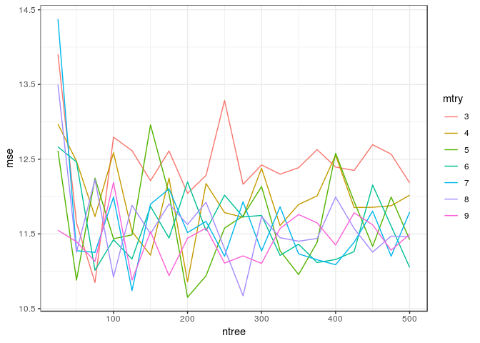

Homework 4: Bags, Forests, Boosts, oh my
================
Liang Lu
2/28/2019

### Load Packages

Problem 1
---------

Problem 7 from Chapter 8 in the text. To be specific, please use a sequence of `ntree` from 25 to 500 in steps of 25 and `mtry` from 3 to 9 for by 1.

``` r
set.seed(1234)
df <- tbl_df(Boston)

  inTraining <- createDataPartition(df$medv, p = .75, list = F)
  training <- df[inTraining, ]
  testing <- df[-inTraining, ]
  mtry <- c(3:9)
  ntree <- seq(25, 500, len = 20)
  results <- tibble(
  mtry = rep(NA, 140),
  ntree = rep(NA, 140),
  mse = rep(NA, 140)) 
  for(i in 1:7){
    for(j in 1:20){ 
      rf_train <- randomForest(medv ~ .,
                               data = training,
                               mtry = mtry[i],
                               ntree = ntree[j])
      mse <- mean((predict(rf_train, newdata = testing) - testing$medv)^2)
      results[(i-1)*20 + j, ] <- c(mtry[i], ntree[j], mse)
    }
  }
```

``` r
results$mtry <- as.factor(results$mtry)
p <- ggplot(results, aes(x=ntree, y=mse, group=mtry, colour=mtry))
p + geom_line()
```



Problem 2
---------

Problem 8 from Chapter 8 in the text. Set your seed with 9823 and split into train/test using 50% of your data in each split. In addition to parts (a) - (e), do the following

``` r
set.seed(9823)
df <- tbl_df(Carseats)
```

1.  Split the data into testing and training datasets.

``` r
inTraining <- createDataPartition(df$Sales, p = .5, list = F)
training <- df[inTraining, ]
testing  <- df[-inTraining, ]
```

1.  Fit a regression tree to the training dataset.

``` r
sales_tree <- rpart::rpart(Sales ~ ., 
                      data = training,
                      control = rpart.control(minsplit = 50))
sales_tree
```

    n= 201 

    node), split, n, deviance, yval
          * denotes terminal node

     1) root 201 1493.06900  7.465721  
       2) ShelveLoc=Bad,Medium 162  931.48560  6.822222  
         4) ShelveLoc=Bad 49  240.27190  5.210204 *
         5) ShelveLoc=Medium 113  508.66760  7.521239  
          10) Price>=105.5 73  240.23530  6.706301  
            20) Advertising< 11.5 54  140.78540  6.281667  
              40) CompPrice< 121.5 18   15.18209  5.420556 *
              41) CompPrice>=121.5 36  105.58240  6.712222 *
            21) Advertising>=11.5 19   62.03941  7.913158 *
          11) Price< 105.5 40  131.47350  9.008500 *
       3) ShelveLoc=Good 39  215.84900 10.138720 *

``` r
prp(sales_tree)
```


``` r
plot(as.party(sales_tree))
```


``` r
test_preds <- predict(sales_tree, newdata = testing)
sales_test_df <- testing %>%
  mutate(y_hat = test_preds,
         sq_err = (y_hat - Sales)^2)
mean(sales_test_df$sq_err)
```

    [1] 5.428695

``` r
sqrt(mean(sales_test_df$sq_err))
```

    [1] 2.329956

1.  use cross-validation

``` r
set.seed(1982)

rf_sales_cv <- train(Sales ~ ., 
                      data = training,
                      method = "rf",
                      ntree = 100,
                      importance = T,
                      tuneGrid = data.frame(mtry = 1:11))
rf_sales_cv
```

    Random Forest 

    201 samples
     10 predictor

    No pre-processing
    Resampling: Bootstrapped (25 reps) 
    Summary of sample sizes: 201, 201, 201, 201, 201, 201, ... 
    Resampling results across tuning parameters:

      mtry  RMSE      Rsquared   MAE     
       1    2.327522  0.4835063  1.880982
       2    2.064376  0.5825965  1.655484
       3    1.957037  0.6000690  1.553626
       4    1.892942  0.6165645  1.503834
       5    1.856871  0.6170286  1.469395
       6    1.840347  0.6177505  1.461519
       7    1.838569  0.6110534  1.457821
       8    1.836504  0.6068632  1.458830
       9    1.836190  0.6048121  1.451467
      10    1.841215  0.5962499  1.460827
      11    1.844077  0.5941374  1.460404

    RMSE was used to select the optimal model using the smallest value.
    The final value used for the model was mtry = 9.

``` r
plot(rf_sales_cv)
```


``` r
p <- ggplot(data = rf_sales_cv$results,
            aes(x = mtry, y = RMSE))
p + geom_point() +
  geom_line()
```


``` r
rf_sales_9 <- randomForest(Sales ~ ., 
                            data = training,
                            mtry = 9)
rf_sales_9
```


    Call:
     randomForest(formula = Sales ~ ., data = training, mtry = 9) 
                   Type of random forest: regression
                         Number of trees: 500
    No. of variables tried at each split: 9

              Mean of squared residuals: 2.812059
                        % Var explained: 62.14

And the test MSE is:

``` r
test_preds <- predict(rf_sales_9, newdata = testing)
sales_test_df <- sales_test_df %>%
  mutate(y_hat_rf_9 = test_preds,
         sq_err_rf_9 = (y_hat_rf_9 - Sales)^2)
mean(sales_test_df$sq_err_rf_9)
```

    [1] 3.043777

The test MSE droped from 5.43 to 3.04.

1.  Use bagging to analyze the data.

``` r
set.seed(10982)
bag_sales <- randomForest(Sales ~ ., data = training, mtry = 9, importance = T)
bag_sales
```


    Call:
     randomForest(formula = Sales ~ ., data = training, mtry = 9,      importance = T) 
                   Type of random forest: regression
                         Number of trees: 500
    No. of variables tried at each split: 9

              Mean of squared residuals: 2.794157
                        % Var explained: 62.38

Compute the test MSE:

``` r
test_preds <- predict(bag_sales, newdata = testing)
sales_test_df <- testing %>%
  mutate(y_hat_bags = test_preds,
         sq_err_bags = (y_hat_bags - Sales)^2)
mean(sales_test_df$sq_err_bags)
```

    [1] 3.0501

``` r
importance(bag_sales)
```

                  %IncMSE IncNodePurity
    CompPrice   19.837758    141.168669
    Income       9.380892    117.487348
    Advertising 14.407033    120.024310
    Population  -2.811587     53.603092
    Price       46.756121    342.357382
    ShelveLoc   52.932730    491.885824
    Age         13.058676    111.747761
    Education    7.767131     54.457950
    Urban       -2.391256      7.694567
    US           5.866683     17.989044

ShelveLocGood is the most important factor and price the next.

1.  Fit a gradient-boosted tree to the training data and report the estimated test MSE.

``` r
set.seed(99)
grid <- expand.grid(interaction.depth = c(1, 3), 
                    n.trees = seq(0, 2000, by = 100),
                    shrinkage = c(.01, 0.001),
                    n.minobsinnode = 10)
trainControl <- trainControl(method = "cv", number = 5)
gbm_boston <- train(Sales ~ ., 
                    data = training, 
                    distribution = "gaussian", 
                    method = "gbm",
                    trControl = trainControl, 
                    tuneGrid = grid,
                    verbose = FALSE)
```

``` r
test_preds <- predict(gbm_boston, newdata = testing)
sales_test_df <- sales_test_df %>%
  mutate(y_hat_gbm = test_preds,
         sq_err_gbm = (y_hat_gbm - Sales)^2)
mean(sales_test_df$sq_err_gbm)
```

    [1] 1.805444

1.  Fit a multiple regression model to the training data and report the estimated test MSE

``` r
sales_lm <- lm(Sales ~ ., data = df)
summary(sales_lm)
```


    Call:
    lm(formula = Sales ~ ., data = df)

    Residuals:
        Min      1Q  Median      3Q     Max 
    -2.8692 -0.6908  0.0211  0.6636  3.4115 

    Coefficients:
                      Estimate Std. Error t value Pr(>|t|)    
    (Intercept)      5.6606231  0.6034487   9.380  < 2e-16 ***
    CompPrice        0.0928153  0.0041477  22.378  < 2e-16 ***
    Income           0.0158028  0.0018451   8.565 2.58e-16 ***
    Advertising      0.1230951  0.0111237  11.066  < 2e-16 ***
    Population       0.0002079  0.0003705   0.561    0.575    
    Price           -0.0953579  0.0026711 -35.700  < 2e-16 ***
    ShelveLocGood    4.8501827  0.1531100  31.678  < 2e-16 ***
    ShelveLocMedium  1.9567148  0.1261056  15.516  < 2e-16 ***
    Age             -0.0460452  0.0031817 -14.472  < 2e-16 ***
    Education       -0.0211018  0.0197205  -1.070    0.285    
    UrbanYes         0.1228864  0.1129761   1.088    0.277    
    USYes           -0.1840928  0.1498423  -1.229    0.220    
    ---
    Signif. codes:  0 '***' 0.001 '**' 0.01 '*' 0.05 '.' 0.1 ' ' 1

    Residual standard error: 1.019 on 388 degrees of freedom
    Multiple R-squared:  0.8734,    Adjusted R-squared:  0.8698 
    F-statistic: 243.4 on 11 and 388 DF,  p-value: < 2.2e-16

``` r
test_preds <- predict(sales_lm, newdata = testing)
sales_test_df <- sales_test_df %>%
  mutate(y_hat_gbm = test_preds,
         sq_err_gbm = (y_hat_gbm - Sales)^2)
mean(sales_test_df$sq_err_gbm)
```

    [1] 0.9635997

1.  Summarize your results.

As showed above, multiple regression has the smallest error rate among all the modeling methods.
